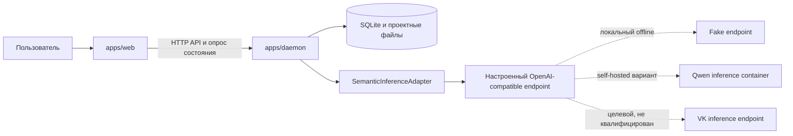
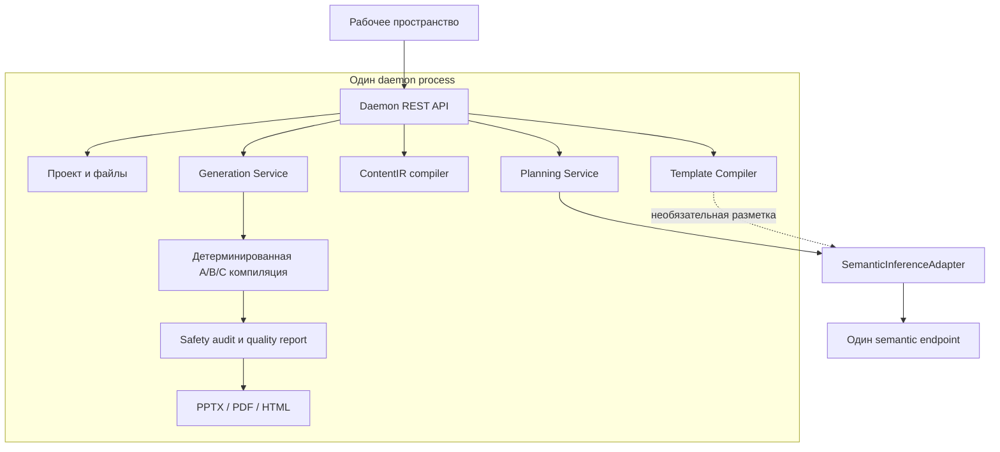
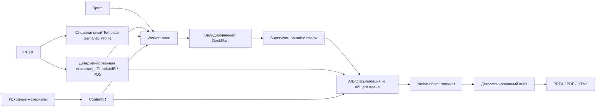

# Архитектура

Это карта текущей реализации. Целевые и непроверенные возможности помечены явно.

## Контекст

Веб-приложение отображает состояние и передаёт действия. Daemon владеет workflow, проектным состоянием, инспекцией, компиляцией, проверками, восстановлением и экспортом. Inference endpoint — отдельная зависимость, не application/domain процесс.

## Компоненты

Worker и Supervisor — разные роли запросов к одному endpoint, не отдельные модели или процессы. Functional modules внутри daemon не означают отдельные сервисы.

## Поток

Semantic решение может сформировать план или оценку роли шаблонного слайда. Код проверяет ID, схему, источники и лимиты; владеет геометрией, объектами PowerPoint, очередью, locks, persistence, ремонтом, аудитом и экспортом. Модельный вывод не меняет PPTX или state до runtime validation.

## Состояние, хранение и кэш

LCT_DATA_DIR задаёт data root и по умолчанию указывает на .lct. SQLite хранит project/generation metadata; проектные файлы — исходные и созданные артефакты. В проекте используются .template-compiler/state.json, .template-compiler/semantic-profiles/, .planning/state.json и .generation/. Исходный PPTX не изменяется.

Кэш TemplateIR привязан к hash источника. Semantic profile cache теперь привязан к hash TemplateIR и fingerprints версии/содержимого prompt/config; смена prompt создаёт новый cache entry. Worker/Supervisor planning fingerprint включает prompt hashes и workflow contract. Клиент восстанавливает состояние из daemon snapshots и опрашивает API во время generation; SSE/WebSocket нет. Restart recovery покрыт offline tests.

## Отказы и безопасность границ

- Daemon может стартовать без semantic endpoint; операция, которой нужен inference, вернёт ошибку конфигурации.
- Timeout, malformed output и schema violation прекращают операцию; непроверенный ответ не применяется.
- Небезопасный вариант может быть withheld.
- Отмена запроса к HTTP endpoint не гарантирует отмену вычислений на GPU.
- Выбранный inference endpoint получает отправленные ему бриф, source evidence или TemplateIR evidence; выбирайте endpoint с подходящими условиями обработки данных.
- Daemon привязан к loopback и не имеет аутентификации. Сетевое/публичное развёртывание не поддерживается.
- Upload ограничен двумя файлами по 64 MiB на один запрос. Антивирусный и подтверждённый zip-bomb gate не реализован.

Независимый source of truth по аудитам: [AUDIT.md](./AUDIT.md); полный список security controls и gaps: [SECURITY.md](./SECURITY.md). Реальные qualification blockers: [docs/READY_FOR_QWEN.md](./docs/READY_FOR_QWEN.md).
