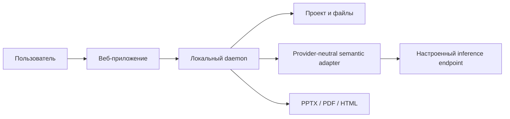

# LCT Presentation Compiler

LCT принимает PPTX-шаблон и задачу, использует необязательные контекст и исходные материалы, строит план презентации, подбирает безопасные композиции и собирает презентацию с редактируемыми объектами. Это компилятор презентаций, а не редактор слайдов.

Основной путь в приложении — кнопка «Сгенерировать презентацию»: анализ шаблона, планирование, варианты A/B/C и обе проверки выполняются одним сохраняемым действием. Контекст и файлы можно не добавлять; результат и стадия восстанавливаются после обновления страницы.

## Возможности

- Структурный анализ PPTX: слайды, макеты, образцы, часть темы и геометрии.
- Чтение TXT, Markdown, CSV/TSV и JSON; изображения сохраняются как вложения/ссылки, неподдерживаемые файлы не считаются разобранным текстом.
- Семантическое планирование через настраиваемый OpenAI-compatible endpoint со строгой проверкой схемы.
- Три варианта A/B/C для каждого слайда из одного плана.
- Детерминированная проверка, ограниченная локальная починка и экспорт в PPTX, PDF или HTML.

Полная совместимость с произвольными PPTX и визуальная точность PowerPoint не заявлены. PDF использует растровое приблизительное превью; HTML — отдельный формат просмотра. Fake-only qualification подтвердила шаблоны VK Tech (12 слайдов), WorkSpace, Education и held-out AIOS (по 3 слайда): selected/A/B/C PPTX прошли структурное reopen; у VK Tech дополнительно проверены PDF и HTML. Canonical one-click runner на 54-слайдовом VK Tech шаблоне создал 12-слайдовую колоду, выполнил 4 fake semantic calls, проверил A/B/C, оба audit и экспорты за 87.597 s. Это локальная проверка pipeline, не оценка качества или latency Qwen/VK. Один canonical runner для fake/external режимов и его лимит в 4 semantic request описаны в [TESTING.md](./TESTING.md) и [LIVE_QUALIFICATION.md](./LIVE_QUALIFICATION.md).

## Архитектура в двух словах



Подробно: [архитектура](./ARCHITECTURE.md).

## Быстрый локальный запуск

Требуются Node.js 24 и Python 3.12 для структурного инспектора PPTX. Команды проверены на Windows в локальном режиме. Из корня репозитория:

```powershell
pnpm dlx pnpm@10.33.2 install --frozen-lockfile
```

Откройте два терминала. В первом запустите локальный fake endpoint, во втором — веб-приложение и daemon. Файл .env.example содержит только loopback-настройки и не содержит секретов.

```powershell
node --env-file=.env.example scripts/dev-fake-semantic-endpoint.mjs
```

```powershell
node --env-file=.env.example scripts/dev.mjs
```

Откройте http://127.0.0.1:3000. Остановка обоих процессов — Ctrl+C. Пошаговая инструкция: [быстрый старт](./docs/getting-started/quickstart.md).

## Offline demo и live inference

Fake endpoint отвечает локально и детерминированно; он не является моделью и не подтверждает качество Qwen. Для live inference приложение использует один настраиваемый OpenAI-compatible endpoint. Доменный код не зависит от RunPod, Cloud.ru или VK. Подробности и границы совместимости: [INFERENCE.md](./INFERENCE.md).

## Форматы и экспорт

Поддерживаемые входы и гарантии форматов перечислены в [руководстве продукта](./docs/product/guide.md). PPTX — основной редактируемый результат. PDF и HTML проходят структурные проверки, но не являются точной визуальной копией PowerPoint.

## Проверки

```powershell
pnpm dlx pnpm@10.33.2 test
pnpm dlx pnpm@10.33.2 typecheck
pnpm dlx pnpm@10.33.2 build
pnpm dlx pnpm@10.33.2 check:boundary
pnpm dlx pnpm@10.33.2 lint:craft
pnpm dlx pnpm@10.33.2 docs:check
git diff --check
```

Подробности: [TESTING.md](./TESTING.md). Полная карта: [docs/index.md](./docs/index.md).

## One-click product E2E

Для локального fake E2E без Qwen, RunPod и внешнего inference:

```powershell
pnpm dlx pnpm@10.33.2 exec node --import tsx scripts/run-product-e2e.mjs `
  --semantic-mode fake `
  --template "C:\path\to\VK Tech шаблон.pptx" `
  --task "Подготовить презентацию по задаче и исходным материалам" `
  --slides 12
```

Runner сам поднимает fake endpoint и проходит тот же persisted one-click backend workflow, что использует UI. Результат и PPTX/PDF/HTML артефакты сохраняются в ignored `.lct/product-e2e/`.

## Ограничения

Статус этого этапа — `PRODUCT_READY_FOR_LIVE`: локальный one-click fake flow, held-out шаблон, track exports, deterministic/contextual audit и автоматические gates прошли. Настоящие Qwen/VK качество, latency и endpoint integration ещё не проверены; визуальный просмотр в PowerPoint/LibreOffice также не выполнялся. Сводный отчёт: [RELEASE_READINESS.md](./RELEASE_READINESS.md).

## Материалы release acceptance

Текущая оценка приёмки: [RELEASE_READINESS.md](./RELEASE_READINESS.md). Сведения о версии и незавершённом candidate: [RELEASE_NOTES.md](./RELEASE_NOTES.md); порядок демонстрации и тезисы: [runbook](./docs/DEMO_RUNBOOK.md), [pitch outline](./docs/PITCH_OUTLINE.md).

## Лицензия

Код репозитория распространяется по Apache-2.0; лицензии model weights указаны отдельно в [MODELS.md](./MODELS.md).
