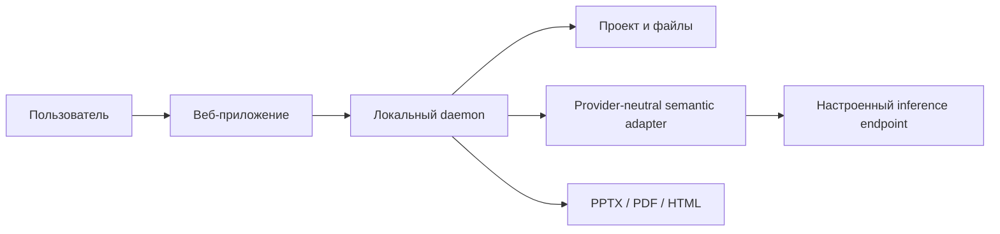

# LCT Presentation Compiler

LCT принимает PPTX-шаблон и задачу, использует необязательные контекст и исходные материалы, строит план презентации, подбирает безопасные композиции и собирает презентацию с редактируемыми объектами. Это компилятор презентаций, а не редактор слайдов.

## Возможности

- Структурный анализ PPTX: слайды, макеты, образцы, часть темы и геометрии.
- Чтение TXT, Markdown, CSV/TSV и JSON; изображения сохраняются как вложения/ссылки, неподдерживаемые файлы не считаются разобранным текстом.
- Семантическое планирование через настраиваемый OpenAI-compatible endpoint со строгой проверкой схемы.
- Три варианта A/B/C для каждого слайда из одного плана.
- Детерминированная проверка, ограниченная локальная починка и экспорт в PPTX, PDF или HTML.

Полная совместимость с произвольными PPTX и визуальная точность PowerPoint не заявлены. PDF использует растровое приблизительное превью; HTML — отдельный формат просмотра. Local fake qualification прошла 9/9 вариантов на трёх заданных шаблонах и полный held-out smoke на AIOS onboarding; native Office визуальная проверка, производительность и live inference остаются непроверенными. Актуальные результаты: [статус готовности](./docs/READY_FOR_QWEN.md).

## Архитектура в двух словах



Подробно: [архитектура](./ARCHITECTURE.md).

## Быстрый локальный запуск

Требуются Node.js 24 и Python 3.12 для структурного инспектора PPTX. Команды проверены на Windows в локальном режиме. Из корня репозитория:

```powershell
pnpm dlx pnpm@10.33.2 install --frozen-lockfile
```

Откройте два терминала. В первом запустите локальный fake endpoint, во втором — веб-приложение и daemon. Файл .env.example содержит только loopback-настройки и не содержит секретов.

```powershell
node --env-file=.env.example scripts/dev-fake-semantic-endpoint.mjs
```

```powershell
node --env-file=.env.example scripts/dev.mjs
```

Откройте http://127.0.0.1:3000. Остановка обоих процессов — Ctrl+C. Пошаговая инструкция: [быстрый старт](./docs/getting-started/quickstart.md).

## Offline demo и live inference

Fake endpoint отвечает локально и детерминированно; он не является моделью и не подтверждает качество Qwen. Для live inference приложение использует один настраиваемый OpenAI-compatible endpoint. Доменный код не зависит от RunPod, Cloud.ru или VK. Подробности и границы совместимости: [INFERENCE.md](./INFERENCE.md).

## Форматы и экспорт

Поддерживаемые входы и гарантии форматов перечислены в [руководстве продукта](./docs/product/guide.md). PPTX — основной редактируемый результат. PDF и HTML проходят структурные проверки, но не являются точной визуальной копией PowerPoint.

## Проверки

```powershell
pnpm dlx pnpm@10.33.2 test
pnpm dlx pnpm@10.33.2 typecheck
pnpm dlx pnpm@10.33.2 build
pnpm dlx pnpm@10.33.2 check:boundary
pnpm dlx pnpm@10.33.2 lint:craft
pnpm dlx pnpm@10.33.2 docs:check
git diff --check
```

Подробности: [TESTING.md](./TESTING.md). Полная карта: [docs/index.md](./docs/index.md).

## Ограничения

Текущая live-release готовность — BLOCKED по незакрытым live/performance и визуальным проверкам. После уточнения организатора task/context-only входа local fake qualification прошла: все 9 вариантов на трёх organizer templates reopened и прошли детерминированный аудит; точный 16-слайдовый AIOS onboarding прошёл held-out E2E, включая проверку source residue. Это не подтверждает качество настоящей модели, бюджет 300 секунд или визуальный проход в PowerPoint/LibreOffice. Подробности и артефакты указаны в [RELEASE_READINESS.md](./RELEASE_READINESS.md).

## Материалы release acceptance

Текущая оценка приёмки: [RELEASE_READINESS.md](./RELEASE_READINESS.md). Сведения о версии и незавершённом candidate: [RELEASE_NOTES.md](./RELEASE_NOTES.md); порядок демонстрации и тезисы: [runbook](./docs/DEMO_RUNBOOK.md), [pitch outline](./docs/PITCH_OUTLINE.md).

## Лицензия

Код репозитория распространяется по Apache-2.0; лицензии model weights указаны отдельно в [MODELS.md](./MODELS.md).
