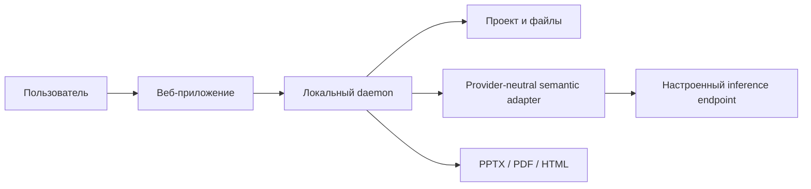

# LCT Presentation Compiler

LCT принимает PPTX-шаблон и задачу, использует необязательные контекст и исходные материалы, строит план презентации, подбирает безопасные композиции и собирает презентацию с редактируемыми объектами. Это компилятор презентаций, а не редактор слайдов.

Основной путь в приложении: загрузить или выбрать PPTX-шаблон и дождаться структурного и семантического анализа. Только после статуса «Шаблон готов» доступно действие «Сгенерировать презентацию». Подготовленный семантический профиль сохраняется в существующем кэше; при Generate система читает готовый профиль и не запускает его inference повторно. Контекст и материалы можно не добавлять; загруженные исходные файлы выбираются автоматически и при необходимости меняются в расширенном режиме. Результат и стадия восстанавливаются после обновления страницы.

Для release и qualification используется Office Kit: он задан в `.env.example` и является default. `custom` сохранён только для явно выбранного legacy/diagnostic режима. Быстрый старт не требует ручного переопределения backend.

## Возможности

- Структурный анализ PPTX: слайды, макеты, образцы, часть темы и геометрии.
- Чтение TXT, Markdown, CSV/TSV и JSON; изображения сохраняются как вложения/ссылки, неподдерживаемые файлы не считаются разобранным текстом.
- Семантическое планирование через настраиваемый OpenAI-compatible endpoint со строгой проверкой схемы.
- Три варианта A/B/C для каждого слайда из одного плана.
- Детерминированная проверка, ограниченная локальная починка и экспорт в PPTX, PDF или HTML.

Полная совместимость с произвольными PPTX и визуальная точность PowerPoint не заявлены. PDF использует растровое приблизительное превью; HTML — отдельный формат просмотра. Последний real browser E2E был выполнен на rehearsal-шаблоне `kompaniya-napravleniya-i-klienty.pptx` (не на WorkSpace): создано 10 слайдов и 30/30 вариантов A/B/C, экспортированы и структурно проверены PPTX/PDF/HTML, после обновления страницы состояние восстановилось. Deterministic audit сообщил 0 ошибок и 21 предупреждение; единственный contextual audit завершился `SERVICE_UNAVAILABLE`, повтор не выполнялся. Визуальный результат остаётся разреженным, а Office-визуальная проверка не подтверждена. Не считать полный release acceptance пройденной. Offline fake E2E WorkSpace и Education прошли по 10 слайдов, held-out AIOS — по 6; локальная VK Tech-копия остановилась на `PREVIEW_LAYOUT_BLOCKED` и не является подтверждённым organizer attachment. См. [RELEASE_READINESS.md](./RELEASE_READINESS.md) и [активный план](./docs/plans/active/final-tz-production-e2e-release.md). Fake pipeline не оценивает качество или latency Qwen/VK; новые live-запросы не выполнять без отдельного разрешения.

## Архитектура в двух словах



Подробно: [архитектура](./ARCHITECTURE.md).

## Быстрый локальный запуск

Требуются Node.js 24 и Python 3.12 для структурного инспектора PPTX. Команды проверены на Windows в локальном режиме. Из корня репозитория:

```powershell
pnpm dlx pnpm@10.33.2 install --frozen-lockfile
```

Откройте два терминала. В первом запустите локальный fake endpoint, во втором — веб-приложение и daemon. Файл .env.example содержит только loopback-настройки и не содержит секретов.

```powershell
node --env-file=.env.example scripts/dev-fake-semantic-endpoint.mjs
```

```powershell
node --env-file=.env.example scripts/dev.mjs
```

Откройте http://127.0.0.1:3000. Остановка обоих процессов — Ctrl+C. Пошаговая инструкция: [быстрый старт](./docs/getting-started/quickstart.md).

## Offline demo и live inference

Fake endpoint отвечает локально и детерминированно; он не является моделью и не подтверждает качество Qwen. Для live inference приложение использует один настраиваемый OpenAI-compatible endpoint. Доменный код не зависит от RunPod, Cloud.ru или VK. Подробности и границы совместимости: [INFERENCE.md](./INFERENCE.md).

## Форматы и экспорт

Поддерживаемые входы и гарантии форматов перечислены в [руководстве продукта](./docs/product/guide.md). PPTX — основной редактируемый результат. PDF и HTML проходят структурные проверки, но не являются точной визуальной копией PowerPoint.

## Проверки

```powershell
pnpm dlx pnpm@10.33.2 test
pnpm dlx pnpm@10.33.2 typecheck
pnpm dlx pnpm@10.33.2 build
pnpm dlx pnpm@10.33.2 check:boundary
pnpm dlx pnpm@10.33.2 lint:craft
pnpm dlx pnpm@10.33.2 docs:check
git diff --check
```

Подробности: [TESTING.md](./TESTING.md). Полная карта: [docs/index.md](./docs/index.md).

## One-click product E2E

Для локального fake E2E без Qwen, RunPod и внешнего inference:

```powershell
pnpm dlx pnpm@10.33.2 exec node --import tsx scripts/run-product-e2e.mjs `
  --semantic-mode fake `
  --template "C:\path\to\VK Tech шаблон.pptx" `
  --task "Подготовить презентацию по задаче и исходным материалам" `
  --slides 12
```

Runner сам поднимает fake endpoint и проходит тот же persisted one-click backend workflow, что использует UI. Результат и PPTX/PDF/HTML артефакты сохраняются в ignored `.lct/product-e2e/`.

## Ограничения

Offline freeze status и его точные evidence приведены в [RELEASE_READINESS.md](./RELEASE_READINESS.md). Качество и latency настоящих Qwen/VK inference, а также итоговая визуальная оценка реального model output остаются отдельными live gates.

## Материалы release acceptance

Текущая оценка приёмки: [RELEASE_READINESS.md](./RELEASE_READINESS.md). Сведения о версии и незавершённом candidate: [RELEASE_NOTES.md](./RELEASE_NOTES.md); порядок демонстрации и тезисы: [runbook](./docs/DEMO_RUNBOOK.md), [pitch outline](./docs/PITCH_OUTLINE.md).

## Лицензия

Код репозитория распространяется по Apache-2.0; лицензии model weights указаны отдельно в [MODELS.md](./MODELS.md).
